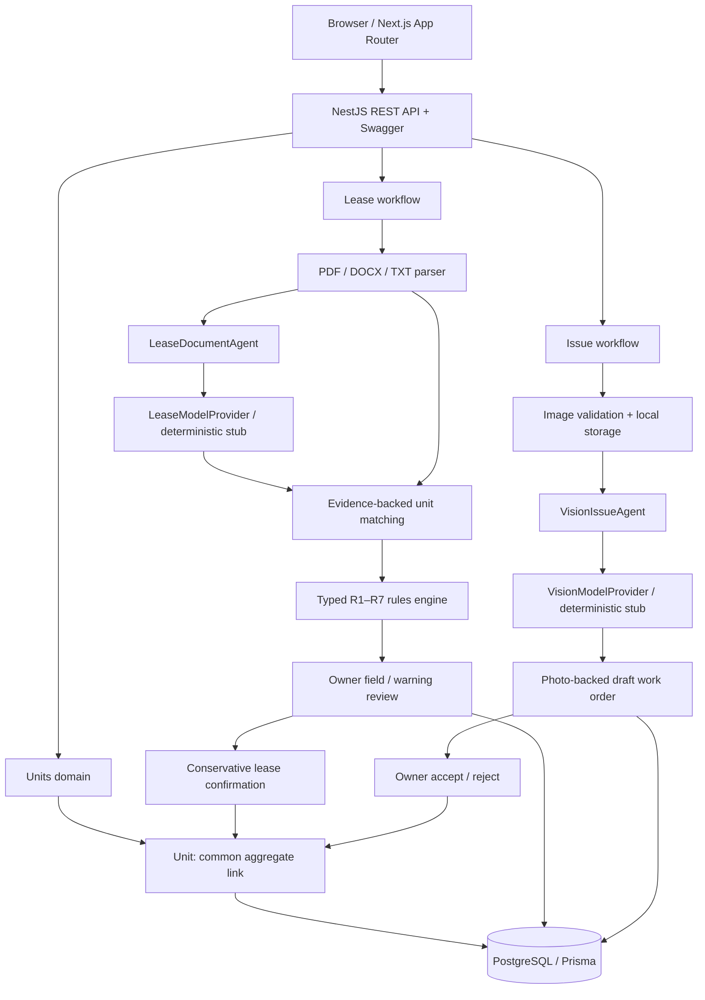

# Marina Crest — Owner workspace

A compact property-owner application that connects lease review and photo-based condition reporting through the **Unit** domain. The implementation includes Next.js 16.3.8 App Router, React, strict TypeScript, Tailwind CSS, accessible native controls, Lucide icons, NestJS REST/Swagger, PostgreSQL and Prisma in an npm workspace monorepo.

This is a runnable coding-assessment implementation with deliberate production limitations. It is **not ready for public production deployment**: authentication was explicitly excluded, analysis is synchronous, files are local, and the model providers are deterministic stubs. No AI credentials are needed.

## What the owner can do

- Browse the supplied property grouped by Tower A / Tower B, with the five exact unit IDs, occupancy, type, area, parking, and lease/issue counts.
- Open a unit workspace containing its candidate/confirmed lease records and condition reports.
- Upload PDF, DOCX or TXT leases; inspect 16 extracted fields and their source locations; accept, reject or correct each field independently.
- Inspect all seven owner-rule results, the values used, and their supporting document sources.
- Accept or reject every warning independently. “Accept warning” acknowledges the warning; rejecting a warning does not override a failed rule.
- Upload one to eight images to a selected unit, preview them, inspect condition/assets/damage and accept or reject the generated draft work order.
- Recover from API/upload failures with clear inline messages. Empty units have dedicated lease and condition states. Desktop and mobile use the same review controls.

The root overview also provides a lease upload action. Unmatched leases remain accessible at `/leases/:id` immediately after upload; the owner can correct the unit field there. Unit uploads never force a document onto the unit currently being viewed.

## Prerequisites and local setup

- Node.js **24 LTS** and npm (no global Next/Nest CLI).
- Docker Desktop with Linux containers, or PostgreSQL 17 with the configured database created.
- Free ports **3000** (web), **4000** (API) and **55432** (database). The database uses 55432 to avoid a common existing PostgreSQL installation on 5432.

From the repository root, on Windows PowerShell:

```powershell
Copy-Item .env.example .env
npm.cmd install
npm.cmd run db:up
npm.cmd run db:migrate
npm.cmd run db:seed
npm.cmd run dev
```

On macOS/Linux:

```sh
cp .env.example .env
npm install
npm run db:up
npm run db:migrate
npm run db:seed
npm run dev
```

The `npm.cmd` spelling avoids PowerShell execution-policy restrictions on `npm.ps1`; the underlying scripts are cross-platform. All commands run from the root. `npm run dev` starts both applications with `concurrently` and stops its sibling when one exits. Stop it with Ctrl+C.

Open:

| Service           | URL                                 |
| ----------------- | ----------------------------------- |
| Owner application | http://localhost:3000               |
| API health        | http://localhost:4000/api/health    |
| Unit records      | http://localhost:4000/api/units     |
| Swagger / OpenAPI | http://localhost:4000/api/docs      |
| OpenAPI JSON      | http://localhost:4000/api/docs-json |

If 3000 is occupied, stop that application yourself or run the web on a different port (`npm run dev -w @marina/web -- --port 3001`) and set `WEB_ORIGIN=http://localhost:3001` before starting the API. Restart the API after changing CORS. The application deliberately permits only the configured web origin.

The seed is idempotent. First seed applies exactly the supplied statuses: 1204, 0902 and 0301 available; 1205 and 0302 occupied. Subsequent seeds update metadata and **preserve live occupancy**. It never inserts analyzed leases or issues. `db:down` stops containers while keeping the database volume.

## Environment

| Variable                         | Purpose / default                                                        |
| -------------------------------- | ------------------------------------------------------------------------ |
| `DATABASE_URL`                   | PostgreSQL connection, `localhost:55432/property_owner_ai?schema=public` |
| `POSTGRES_PORT`                  | Compose host port, 55432                                                 |
| `API_PORT`                       | API port, 4000                                                           |
| `WEB_ORIGIN`                     | Allowed browser origin, `http://localhost:3000`                          |
| `NEXT_PUBLIC_API_URL`            | Browser API base **including `/api`**, `http://localhost:4000/api`       |
| `MODEL_PROVIDER`                 | `stub`; other providers fail at startup until implemented                |
| `UPLOAD_DIR`                     | `./uploads`, resolved from the workspace root                            |
| `AI_API_KEY`, `AI_MODEL`         | Empty placeholders; unused in stub mode                                  |
| `PLAYWRIGHT_CHROMIUM_EXECUTABLE` | Optional installed browser path for browser E2E                          |

The API locates the root `.env` in development and compiled execution. Next's configuration loads that same root file. Browser environment variables are baked into the frontend build; rebuild after changing `NEXT_PUBLIC_API_URL`. Never put secrets in `NEXT_PUBLIC_*`. `.env` and runtime uploads are gitignored.

## Try the supplied fixtures

1. Open **Apartment 1204** (`MC-B-1204`) on a freshly seeded database.
2. Upload `test-data/leases/sample-lease.txt`. All 16 fields begin pending, with line evidence and no invented PDF pages. R1–R7 pass. The unit remains available.
3. Expand a field's **Source**, then use **Accept**, **Edit → Save & accept**, or **Reject**. Original extraction remains visible after correction. Every correction recalculates rules.
4. Accept all 16 fields. With no outstanding warnings and all rules passing, the lease becomes confirmed and 1204 becomes occupied atomically. Merely accepting its unit field does not change occupancy.
5. Open **Condition & issues** and select both `test-data/photos/mc-b-1204-ac-leak.svg` and `mc-b-1204-wall-damage.svg`. These repository-owned illustrations show moisture beneath an AC and wall cracks/worn paint.
6. Inspect the condition, items, damage, image sources, and pending draft work order. Accepting or rejecting the draft stores your decision; it never dispatches maintenance.
7. On **Apartment 1205**, upload `problematic-lease.txt`. R1, R2, R3, R5, R6 and R7 fail; R4 passes for the consistent 48-month dates. Missing/ambiguous clauses are flagged. The existing occupied status is untouched.

Re-uploading the sample after 1204 is confirmed correctly causes R7 to fail because the unit is now occupied. It does not release or replace the current lease.

## Architecture



Nest's `PrismaModule`, `UnitsModule`, `LeasesModule`, `IssuesModule`, `AgentsModule`, `RulesModule` and `StorageModule` separate persistence, workflows, provider boundaries and deterministic policy. The compact API controller handles HTTP DTOs; services own domain operations. `responses.ts` projects intentional frontend contracts instead of exposing raw Prisma models.

```text
apps/web/             App Router screens, review components, typed API client
apps/api/src/         Nest modules, services, agents, parsers, rules and storage
packages/contracts/   Frontend-safe shared types and field labels
prisma/               Relational schema, committed initial migration, seed
config/units.json     Exact supplied property/building/unit seed source
config/rules.json     Exact R1–R7 metadata, textual checks, version and notes
test-data/leases/     Clean and problematic lease fixtures
test-data/photos/     Two original, passive SVG condition illustrations
tests/                Rule/agent/UI tests, DB integration, browser E2E
docker-compose.yml    Focused PostgreSQL container and persistent volume
```

## Relational data model

`Property → Building → Unit` preserves supplied IDs as primary identifiers. A lease has a nullable **candidate unit** separate from its **confirmed unit**. A guess can appear in the unit's review context without becoming a confirmed lease relationship.

`Lease → LeaseDocument → LeaseSourceReference` retains storage metadata and per-field source references. `LeaseExtractedField` stores original/current scalar JSON values, confidence, override state, review status and review time; financially meaningful values also use `Decimal(18,2)` with explicit QAR currency. Scalar JSON supports heterogeneous text/boolean/date/number field types without reducing the domain to one JSON document. Rules store their relevant scalar inputs as JSON; relations and status columns remain typed and indexed.

`LeaseFlag` and `LeaseRuleValidation` relate to the exact source references they use. Rule rows are unique per lease/rule ID. Warnings retain the original analysis message even after owner correction; current rule results recalculate. This preserves what the owner reviewed rather than erasing historical warnings.

`IssueReport → IssuePhoto / IssueAssessment / DetectedAsset / DetectedDamage / DraftWorkOrder` uses relational photo joins for assessment, findings and draft evidence. The affected unit is inherited through the issue relationship. Field, warning and work-order review metadata is persistent, with timestamps. This is latest-decision metadata, not a complete event-history audit log.

Foreign keys protect references. Unit/status and lease/review lookups are indexed. Cascades apply to owned analysis children; deleting a property/unit cannot silently cascade away leases or issues.

## Lease workflow and provenance

1. Validate extension, submitted MIME, file size and basic content signatures.
2. Parse through `DocumentParser`: PDF text is extracted page by page and split into lines; UTF-8 TXT is split into lines. DOCX parsing walks paragraphs and table cells, including nested tables and multiple paragraphs within a cell. DOCX/TXT have **no invented page numbers**. Scanned or empty PDFs return a readable parser error; OCR is not implemented.
3. Preserve original chunk text and invoke `LeaseDocumentAgent → LeaseModelProvider.extract`. Heading recognition and unit matching normalize case, whitespace (including non-breaking spaces) and Unicode dashes without changing the stored evidence.
4. Normalize values, retain source excerpts/confidence and derive missing monthly/annual rent only from a valid corresponding figure. Derivations keep their input source and formula; conflicting stated figures are not overwritten.
5. Independently match document evidence against known units: prefer exact external IDs; otherwise use exact normalized labels and any recognized property/building context. Only a unique result becomes a candidate. Multiple distinct IDs or unresolved labels require human review; unknown or partial IDs do not receive a fuzzy match.
6. Evaluate seven typed rule validators, detect missing information, failed/unknown rules, ambiguous clauses and suspicious zero figures.
7. Store document, fields, sources, validations, warnings and candidate relation in one database transaction. Generated storage names never use the client filename as a path. Failed persistence removes newly stored files.
8. Return pending human review. Rejected fields are treated as unknown by subsequent rule evaluations.

Lease formatting varies: a unit or rent value may share a paragraph with its heading, occupy the next paragraph, or sit in a separate table cell. Extraction therefore cannot rely on ordinary paragraphs alone. The stub supports unit headings such as Unit ID, Unit Number, Apartment No and Premises; table label/value lookup stays within the same row to avoid consuming an unrelated value. Its heading-based interpretation remains limited. Unrecognized valid documents return unknown fields and review flags. Supported but malformed files return controlled validation/parser errors instead of crashing the application.

Source references retain the filename, chunk identifier, original excerpt, confidence and available page/paragraph/line location. Table chunk IDs encode table, row, column and paragraph, rather than inventing page locations. Matching evidence is saved alongside unit extraction sources, including the contributing chunks when a label spans lines. Missing fields produce review flags; an unknown extracted unit can still retain genuine evidence for a candidate. Human overrides retain original source evidence; that evidence attests to the original document value, not the owner's correction. The UI marks corrections as **Owner override**.

Matching does not rewrite the provider's extracted unit value or approve it. A candidate supported by document evidence may exist while the unit field remains unknown. R7 cannot pass from that candidate alone or from an unsupported provider ID; the owner must resolve the field through review. Ambiguous/unmatched uploads remain available at their lease review URL, with a warning and no automatic unit link or occupancy change.

### Engineering note: Apartment 0902

The reported Apartment 0902 (`MC-B-0902`) issue exposed a formatting assumption: the unit information appeared in a DOCX table, rather than an ordinary paragraph. The parser now retains table structure in chunk IDs, the stub can read adjacent label/value cells, and the matcher checks the complete parsed evidence against known units. This addresses that layout without depending on one fixed unit heading or silently replacing the extracted value.

Generated DOCX regression fixtures recreate this case. Database integration tests verify the candidate, persisted table evidence and unchanged occupancy after upload, alongside occupied-unit, ambiguous-ID and unsupported-provider-ID cases. This coverage does not imply that every lease layout is understood by the stub.

## Deterministic rules and occupancy

The model interprets unstructured content. Application code enforces policy, avoiding nondeterministic arithmetic, date comparisons and occupancy decisions. The configuration's `check` strings are metadata only; **no `eval`, `Function` or dynamic code execution** is used.

| Rule | Explicit validator                                                             |
| ---- | ------------------------------------------------------------------------------ |
| R1   | Non-negative decimal deposit ≥ positive monthly rent                           |
| R2   | Actual percentage, fixed QAR increment or CPI mechanism; vague agreement fails |
| R3   | Positive whole-month term ≤ 36                                                 |
| R4   | Valid date order and dates reconcile with stated term                          |
| R5   | Both identified parties and both stated signature statuses                     |
| R6   | Exact decimal annual rent = monthly × 12                                       |
| R7   | Exact unit exists and is available before confirmation                         |

Dates remain `YYYY-MM-DD` date-only values and display in UTC. The end-date calculation supports inclusive final-day leases (1 Jan–31 Dec = 12 months) and anniversary-exclusive ends. Non-whole-month periods cannot pass a whole-month term check. A signature statement in the stub is not cryptographic or visual signature verification; owner review remains mandatory.

`mayConfirmLease` requires all 16 fields **ACCEPTED**, every warning reviewed (accepted or rejected), all seven rules **PASS**, and an available unit. No owner-approval exception for >36 months is implemented; that rule remains a failure in this scope. Review and confirmation use serializable transactions and a conditional available→occupied update. Another lease cannot silently take an occupied unit. Confirmed fields are locked, avoiding later corrections invalidating the occupancy decision. There is no release/expiry lifecycle in this assessment.

R7's confirmed-lease result records that the unit was available at confirmation; its own occupancy change does not make its accepted lease invalid. A second lease still sees that unit as occupied and fails R7.

## Vision workflow and stub honesty

The unit must be selected before upload. Files are validated, decoded for image metadata/pixel bounds and stored with generated names. `VisionIssueAgent → VisionModelProvider.assess` returns condition, items, visible damage and a pending draft with photo IDs. Report/photos/assessment/findings/draft persist together; failed transactions clean up files.

Fixture recognition uses **SHA-256 of repository fixture bytes**, not filenames. Renaming a fixture still works; renaming an arbitrary photo to a fixture name does not manufacture analysis. AC findings report visible staining/possible leakage, without claiming a diagnosis, internal failure or appliance age. Arbitrary images return **UNCERTAIN**, no invented assets/damage, and a clearly labeled inspection/review draft. Mixed uploads retain known evidence and disclose unrecognized images.

## Human review

Fields, warnings and drafts each independently store `PENDING`, `ACCEPTED` or `REJECTED`. There is no auto-acceptance. Financial/date overrides are validated server-side, preserve `originalValue`, update `currentValue`, mark the override and rerun deterministic rules. Null corrections remain unknown and cannot pass confirmation. Warning review never changes a rule result. Draft acceptance records a human decision while keeping the entity a draft; scheduling, dispatch and full maintenance lifecycle are excluded.

## REST API

All routes use `/api`. Swagger provides multipart upload documentation and DTO models. Nest ValidationPipe enables whitelist, forbidden unknown properties and transformation; explicit DTO pipes preserve validation when running through tsx without emitted design metadata.

| Method | Route                         | Purpose                                               |
| ------ | ----------------------------- | ----------------------------------------------------- |
| GET    | `/units`                      | Overview metadata and counts                          |
| GET    | `/units/:id`                  | Unit, lease analyses and issues in one response       |
| POST   | `/leases`                     | Multipart `file` → pending extraction                 |
| GET    | `/leases/:id`                 | Lease analysis / sources / reviews                    |
| GET    | `/leases/:id/validations`     | Seven current rule results                            |
| PATCH  | `/leases/:id/fields/:fieldId` | `{status, value?}`; optional correction + acceptance  |
| PATCH  | `/leases/:id/flags/:flagId`   | `{status}` warning decision                           |
| POST   | `/issues`                     | Multipart `unitId` + one to eight `photos`            |
| GET    | `/issues/:id`                 | Condition analysis and draft                          |
| PATCH  | `/work-orders/:id`            | `{status}` draft decision                             |
| GET    | `/files/:key`                 | Referenced document download / passive image evidence |
| GET    | `/health`                     | Minimal setup check                                   |

Review statuses accepted by PATCH are only `ACCEPTED` and `REJECTED`. Uploads return 201; bad input 400; missing records 404; conflicting review/linkage 409; oversize uploads 413. Errors use `{statusCode, code, message}` without client stack traces. The unit workspace uses one aggregate request, avoiding per-field/per-issue request fan-out.

Processing is synchronous: the browser exposes processing text while awaiting the request; successfully persisted analyses have `COMPLETED`. Validation/parser/model/storage failures return `PROCESSING_FAILED` or a specific request error, with no partial analysis record. The schema/contracts include pending/processing/failed states for later evolution, but no background job manager or durable failed-job history is implemented.

## Validation commands

```sh
npm run lint
npm run typecheck
npm test
npm run build
npm run test:integration
npm run test:e2e
```

- `npm test`: focused R1–R7, date/money/occupancy guards, DOCX paragraph/table parsing (including nested tables), normalized headings and unit matching, ambiguity handling, provider honesty, safe file handling and accessible field/draft rendering. PDF page/line provenance uses mocked text-extraction output; this is not OCR coverage. DB tests are explicitly skipped in this credential-free command.
- `test:integration`: real Nest HTTP requests through Supertest, Prisma and PostgreSQL. Creates a fresh process-specific schema, deploys committed migrations, seeds supplied data, exercises upload/review/override/warnings/drafts/occupancy and error cases, plus DOCX table evidence persistence, available/occupied unit checks, ambiguous matches and missing or unsupported extracted unit values, then removes **only that schema** and its temporary uploads. It does not reset application data.
- `test:e2e`: requires `npm run build` first. Starts the production frontend on **3001**, test API on **4001**, and its own fresh database schema. Clicks through upload, source inspection, all field acceptances, occupancy, multi-photo issue, draft acceptance and reload persistence in headless Chrome. Checks mobile width and browser runtime errors; screenshots go in ignored `test-results/`. Keep ports 3001 and 4001 free for this test.
- Browser E2E uses installed Chrome/Edge on Windows, `PLAYWRIGHT_CHROMIUM_EXECUTABLE` if supplied, or Playwright Chromium. On other platforms, run `npx playwright install chromium` before browser tests.
- `npm run db:generate`: Prisma client generation; `npx prisma validate`: schema validation.
- `npm run format`: Prettier formatting. ESLint rejects unsafe `any` and unused code. Both apps and shared contracts compile strictly.

For compiled runtime, after a build run `npm run start:api` and `npm run start:web` in separate terminals. TypeScript's API output preserves the shared configuration/contracts directory structure, so the root API command points to `apps/api/dist/apps/api/src/main.js`.

Dependencies are locked. Patched transitive overrides for Prisma's CLI configuration libraries and Swagger YAML eliminate known advisories without migrating this assessment to a different Prisma/Nest major; generation, migration, schema, HTTP and build checks validate the chosen combination. Use `npm audit` to reassess as advisories change.

## Connecting a real model provider

Implement **`LeaseModelProvider.extract({filename, chunks})`** in `apps/api/src/agents.ts`: submit parsed text/source chunk IDs and require the same 16-field `Extraction[]` contract, typed scalar values, source IDs/excerpts and calibrated confidence. Validate provider responses, reject missing/fabricated chunk IDs and normalize dates/QAR amounts before domain persistence. A production integration must treat document text as untrusted data, not model instructions.

Implement **`VisionModelProvider.assess({unitId, photos})`**: submit decoded image content to a multimodal model and return the existing `VisionOutput` contract. Findings/drafts must cite only supplied photo IDs; use uncertainty for non-visible facts. Validate output structure, limit latency/cost, and handle provider failure without partial persistence.

Register these implementations in `AgentsModule` behind `MODEL_PROVIDER`. The hypothetical integration would consume `AI_API_KEY`, `AI_MODEL` and any provider-specific endpoint. Choose the SDK for that provider, define timeouts/retry and output validation, and add contract/evaluation tests. These credentials are neither read nor required by the current stub. The rules engine and human-review gates remain unchanged.

## Decisions, security and limits

- Native buttons, file inputs, selects, textareas and disclosure controls keep the UI lightweight and keyboard accessible; visible focus, semantic headings, image descriptions and status text accompany colors. No custom modal/focus trap is needed for inline editing.
- Client components handle interactive review/upload state; route/layout shells are server components. No Redux, global store or frontend Prisma imports.
- Decimal arithmetic is used for financial policy and Prisma numeric columns. Browser number conversion is presentation only. Dates avoid browser-local timezone shifts.
- Local storage and synchronous transactions keep the assessment demonstrable without infrastructure beyond PostgreSQL. Filesystem writes cannot participate in a DB transaction; cleanup handles ordinary failures, but a process crash between storage and commit can leave an orphan file.
- Maximum 10 MB/file, eight photos and 20 megapixels per image. Server checks MIME, extension, signatures/decoding, generated paths and scalar corrections. SVGs allow only passive drawing/text tags and reject scripts, event handlers, external references, styles with URL references and XML declarations/entities. File responses set nosniff and restrictive CSP; lease downloads use attachment disposition.
- The API binds to loopback, has a narrow CORS origin and exposes sanitized errors. **No authentication by explicit scope** means any local API caller can read/review records; do not expose this service publicly. CORS is not access control.
- DOCX/PDF parsing occurs in-process. Size/text limits help but do not provide a hardened sandbox for malicious document decompression or parser exploits. No malware scanning, OCR or independent signature verification.
- The stub's field confidence is a deterministic demonstration score, not an empirically calibrated model probability. Heading-based interpretation is intentionally limited. R2 recognizes a small set of explicit mechanisms; unusual legal mechanisms need a richer real provider contract and typed validator support.
- Warnings and review timestamps preserve original output/current decision, not every successive review event. Confirmed leases lock fields. Unknown/unmatched leases need their returned review URL; no extra generic document-library screen was added.

## Relevant Real-Estate Experience

I previously worked on a production real-estate engagement for Aldar Properties using Next.js, NestJS, Sitecore, Azure DevOps and Datadog. My responsibilities included technical and support delivery leadership, code reviews, sprint planning, release coordination, production issue handling, SLA adherence and knowledge-transfer sessions.

The engagement covered more than 3,000 support/service tickets, with approximately five releases per week on average. Reliability and a quick response to business issues mattered in that environment. I also created an internal reporting tool to improve visibility into support and delivery activities. That work reinforced the value of traceability, clear ownership and operational information that helps people decide what to do next.

That experience informed how I approached this assessment. I made the unit the common link between leases and condition reports, kept AI output open to owner review, and retained the evidence behind it. I also separated model interpretation from deterministic rules. An incorrect rent amount, lease date or unit assignment can have consequences beyond the screen where it appears. I wanted an owner to be able to check the information before approving a decision. This is an independent assessment project, not a system delivered to or endorsed by Aldar.

## What I Would Do in the Next 30 Days

The assessment deliberately covers two core workflows: lease review and condition reporting. With another 30 days, I would focus on making those workflows more accurate, faster to verify and safer to use across a portfolio. I would work in small, testable increments, starting with representative documents and photos rather than trying to build a complete property-management platform. The work below is planned, not implemented.

### Days 1–7 — Improve AI accuracy and evidence

- **Connect a real multimodal provider.** Implement the existing lease and vision provider interfaces without rewriting the domain workflows. Stub mode would stay available for automated tests, local development and demos without credentials. I would validate returned values and evidence IDs before persistence, while keeping deterministic rule checks and human approval separate from model reasoning.
- **Add OCR and document preprocessing.** The current parser works with text-readable files and rejects scanned or empty PDFs. I would start with scanned PDFs, photographed documents and image-based leases, retaining page locations so OCR output can still be checked against the original.
- **Highlight source evidence.** Build on the existing excerpts and page, paragraph or line references. Opening a monthly-rent source should show the corresponding passage highlighted in the document, rather than requiring the owner to find it manually.
- **Detect contradictions more clearly.** Build on the implemented detection of multiple known unit IDs and rent reconciliation, adding checks for conflicting rent clauses, dates, renewal terms and signature statements. Model findings would remain review suggestions; arithmetic, date and occupancy checks would stay in application code.

### Days 8–14 — Make owner review faster

- **Put uncertain information first.** Prioritize missing fields, uncertain extractions and contradictions in the review order. Confidence could help internally once evaluated, while percentages would continue to stay out of the main UI. The current stub scores are not calibrated probabilities.
- **Compare leases for the same unit.** Add a previous-versus-new view for renewals, highlighting changes in rent, deposit, start/end dates, escalation, renewal and termination clauses. Comparison would not replace a confirmed lease or change occupancy automatically.
- **Extend review metadata into an audit trail.** The project already preserves original AI values, owner corrections and the latest decision timestamps. I would add append-only review events recording the original value, correction, accepted/rejected decision and time, so successive decisions remain visible.
- **Add straightforward portfolio filters.** Start with available/occupied units, leases needing review, failed acceptance rules and units with open issues. This would help owners find pending work without adding a separate dashboard.

### Days 15–21 — Make property issues more useful

- **Flag possible duplicate issues.** Before generating another draft, check whether the unit already has a similar unresolved report, such as repeated photos of the same AC leak. Show the possible match for owner review rather than silently merging reports or creating duplicate maintenance work.
- **Make issue history easier to inspect.** Reports are already stored against the unit. I would add a chronological view that makes recurring AC leaks, moisture damage or appliance problems easier to spot, without treating a pattern as a confirmed diagnosis.
- **Suggest issue priority.** Let the agent suggest Low, Medium or High based on visible evidence, with a reason and source photos. The owner would approve the priority; it would not trigger scheduling or dispatch.
- **Allow draft work-order edits.** Owners can currently accept or reject a draft. I would let them edit its title and description before acceptance, preserving both the original AI draft and the final owner-approved version, as lease-field corrections already do.

### Days 22–30 — Prepare the system for real usage

- **Introduce background jobs.** Move parsing, OCR, AI calls and image processing out of synchronous HTTP requests. Larger documents and model latency make durable job status, bounded retries and clear failure feedback necessary. Review and occupancy gates would remain unchanged.
- **Move uploads to object storage.** Put storage behind an interface and implement AWS S3 or Azure Blob Storage, with private files and short-lived signed access where needed. Local storage would remain useful for development.
- **Add authentication and basic roles.** Introduce Owner, Property Manager and Inspector access, including checks on which property records each person can read or review. Authentication and role management were intentionally excluded from this assessment; they are required before broader use.
- **Build a correction-based evaluation loop.** An owner changing rent from QAR 15,000 to QAR 12,500 should become a reviewed evaluation example. So should correcting “No visible damage” to “Water damage visible below AC,” together with the relevant photos. I would use these examples to build a held-out dataset for measuring extraction and vision accuracy, then compare providers and prompts against it. A newer model should earn its place through measured results, rather than an assumption that it improves the product. Corrections would feed evaluation, not automatic changes to financial values or model training without a separate decision.

### Why these first?

Rent collection, vendor management, messaging and maintenance scheduling could all follow. I would first strengthen the two workflows this assessment demonstrates: information that owners can verify, review decisions that remain traceable, and issues that are useful across a portfolio. AI would suggest, software would validate deterministic rules, and people would approve decisions with operational consequences. Broader automation becomes more useful once those foundations are dependable.

## Scale pressure and architecture evolution

Synchronous parsing/model calls and in-memory multipart uploads would hit CPU, memory, latency and concurrency limits first. Large document decompression, local filesystem capacity, unpaginated unit aggregates and model costs would follow. A single PostgreSQL instance and repeated full-unit refreshes suit five units, not a large portfolio.

The current parser/provider/service boundaries allow processing to move behind background workers, storage to move to an object store and aggregate queries to gain pagination without changing review or rule semantics. Database constraints and transaction gates must remain the authority for occupancy even with distributed processing. None of that extra infrastructure is implemented here.

## Intentionally excluded

Authentication, signup/login, user management, RBAC, payments/rent collection/accounting, notifications/email/SMS, tenant portal, chat/chatbot, calendar, maps, analytics, vendors/technician assignment, invoices, scheduling, cloud deployment, queues, Redis, Elasticsearch, GraphQL and mobile apps. No unrelated CRUD screens, marketing dashboard, or generic document library.

## Longer-Term Possibilities — NOT IMPLEMENTED

A maintenance/vendor workflow and pagination for larger portfolios would follow the priorities above. Any future dispatch flow would require explicit authorization beyond accepting the current draft. These remain documentation ideas, not implemented functionality.
